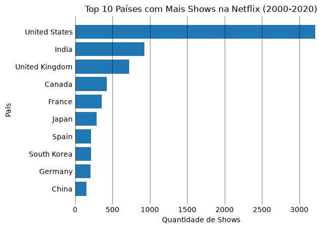

# 🎬 Análise Netflix

Análise exploratória do catálogo de filmes e séries da Netflix, usando Python, pandas e Matplotlib, com foco em distribuição por país e produção ao longo do tempo.

---

## ❓ Perguntas de investigação

1. **Quantidade de shows por país**, considerando um determinado intervalo de ano de lançamento.
2. **Títulos mais recentes e mais antigos adicionados por país** ao catálogo.
3. **Diretores com mais filmes**, desconsiderando títulos sem diretor listado.

---

## 📊 Fonte dos dados

Dataset público **"Netflix Movies and TV Shows"**, disponível no Kaggle:
https://www.kaggle.com/datasets/shivamb/netflix-shows

Contém informações sobre filmes e séries do catálogo da Netflix, como título, diretor, elenco, país, data de adição, ano de lançamento, classificação etária, duração e categorias.

---

## 🛠️ Ferramentas utilizadas

- Python
- pandas
- Matplotlib

---

## 🔎 Principais descobertas

### 1. Shows por país



> Conclusão: O catálogo da Netflix de 2000 a 2020 é imensamente dominado pelos Estados Unidos, com uma quantidade de shows muito superior a qualquer país, mais do que o triplo do segundo colocado, a Índia. É importante destacar que aqueles títulos cujo país de origem não estava especificado no dataset original foram excluídos desta análise, já que "país desconhecido" não representa uma categoria geográfica real.

## 📁 Estrutura do projeto
```
├── data/ # dataset original (CSV)
├── images/ # gráficos gerados pela análise
├── notebook/ # código da análise (formato #%%)
└── README.md
